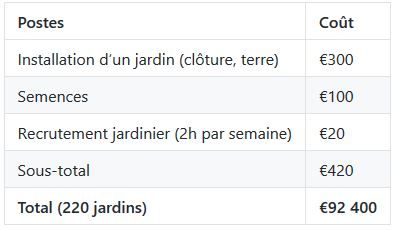

# Business Model

## Proposition stratégique : 
Nous voulons sensibiliser la société française, plus particulièrement les enfants en école primaire, aux circuits courts afin de changer de changer les habitudes alimentaires dès le plus jeune âge. Nous proposons donc d’introduire des jardins en permaculture dans les écoles d’Ile-de-France. 

## Clients :
Ce projet sera fait main dans la main avec les élèves d’écoles primaires, les professeurs et les jardiniers. Nous avons fait le choix de nous concentrer exclusivement sur les enfants en école primaire afin d’avoir un impact le plus large possible, les enfants pouvant à leurs tours sensibiliser leurs entourages (famille, amis). Pour que ce projet soit une réussite il faudra former le personnel scolaire afin qu’ils soient en mesure de superviser efficacement les sessions de permaculture.  

## Financement / Formation :
La majorité du financement de ce projet viendra des collectivités locales (la région et/ou les municipalités). Le principal poste de coût sera l’installation du jardin dans les écoles. Dans l’optique où certaines écoles n’auraient pas assez de place, nous proposons d’utiliser les jardins publics qui ont l’avantage, dans la plupart des cas, d’avoir déjà un espace dans le jardin dédié à la permaculture. De plus cela permettra de regrouper certaines écoles ensemble et ainsi réduire les couts (il ne faudra pas recruter des jardiniers en plus). 

La livraison des jardins se fera à l’aide de véhicules spécialisés sous la supervision du jardinier de l’école. Ce dernier – à recruter en fonction du personnel existant dans les écoles – sera en charge de superviser le jardin pendant toute l’année et de s’assurer avec le personnel scolaire que les élèves puissent venir de façon régulière s’occuper du jardin.

Il faudra aussi former les professeurs : Nous recommandons de former en priorité les professeurs de SVT afin qu’ils puissent intégrer une partie du programme scolaire dans cette activité.

Enfin, afin d’équilibrer le budget nous souhaitons interagir autant que possible avec les producteurs d’Ile-de-France. Ces derniers seront invités à venir présenter et enseigner la permaculture aux élèves et auront la possibilité à la fin de la session d’organiser une vente aux parents d’élèves. 

## Flux de revenus : 

Nos clients directs, qui sont de jeunes enfants, n'ont évidemment rien à payer. Ce sont les autorités locales qui doivent financer ce projet et en particulier les municipalités car elles sont responsables des écoles en France. Les aliments cultivés dans ces jardins seront ensuite consommés par les élèves, ce qui réduira légèrement les frais de cantine. 

## Structure des coûts :

Dans notre “business plan”, les principaux coûts sont d’abord ceux de l'installation des jardins puis ceux du recrutement de jardiniers et enfin, dans une deuxième phase, de l’entretien de ces jardins.

Des économies d'échelle peuvent être réalisées avec les produits achetés, en particulier dans le cas des jardins publics. Les producteurs pourraient également fournir une partie des récoltes nécessaires. En effet, ce coût mineur sera plus que compensé par la possibilité de vendre des produits aux parents.

## Partenaires clés :
Nos fournisseurs sont les fermes locales avec lesquelles nous travaillons en étroite collaboration. 

Nos partenaires sont donc les écoles et les autorités locales qui acceptent de participer au projet. Les ressources clés de nos partenaires sont leur autonomie et leur autosuffisance. Une fois installés, les jardins n'ont idéalement plus besoin de notre intervention. Les activités clés de nos partenaires se situent dans le domaine de l'éducation. Nous nous inscrivons donc dans cette même démarche en proposant une pratique concrète d’une problématique fondamentale.

## Chiffres clés :

Les jardins collectifs seront instaurés dans un premier temps en Île-de-France. Concernant la ville de Paris, nous aimerions les installer dans 40 écoles, soit 2 jardins collectifs par arrondissement. 

Concernant les autres départements franciliens, un jardin collectif sera établi dans une école de chaque canton. Puisque la région compte 173 cantons, il s’agit donc de créer 173 jardins. 

## Business Plan :
{:width="50%"}

Le coût maximum de ce projet (en prenant pour hypothèse qu’il faudrait recruter 100% des jardiniers) est de €92 400. 

