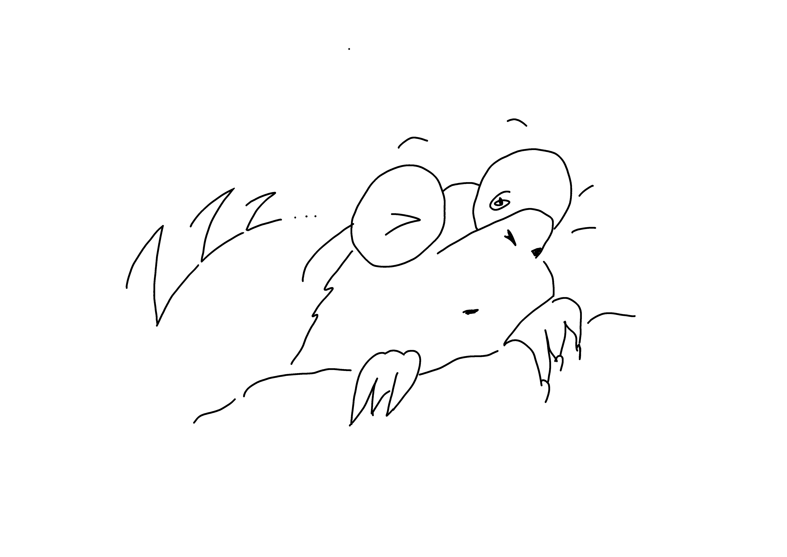

# About us

Nous sommes un groupe de cinq étudiants en master de l’Ecole de Management et d’Innovation de SciencesPo. Dans le cadre de notre cours _The Great Transition_, nous avons eu pour mission de réfléchir ensemble autour d’une problématique contemporaine.

{:class="avatar"}
**Lévon ARUTYUNYAN**
_Master Marketing_

{:class="avatar"}
**Côme DE LA PRESLE**
_Master Finance et Stratégie_

{:class="avatar"}
**Flore MENIGOZ**
_Master Finance et Stratégie_

{:class="avatar"}
**Elodie SOLAL**
_Master International Management and Sustainability_

{:class="avatar"}
**Laura TRAD**
_Master Master of Communications, Media and Creative Industries_

## Pourquoi ce sujet ?

Nous avons choisi de travailler autour du thème des filières courtes et des liens entre alimentation, santé et environnement. Au cours de notre première entrevue, il est apparu que l’alimentation était une problématique importante pour nous. En essayant de se trouver des points communs, nous avons découvert que deux d’entre nous étions végétariens. En discutant les avantages et inconvénients d’un régime végétarien ou végétalien, nous nous sommes bien rendus compte de l’absence d’un consensus sur la question. Que se soit sur son impact écologique, ses bienfaits pour la santé ou ses motivations éthiques, les points de vue sont multiples et les faits scientifiques difficiles à démêler. Arrêter totalement la consommation de viande et autres produits d’origine animale, est-ce réellement la meilleure solution pour sauver la planète ? Ne vaudrait-il pas mieux manger un steak bio et local plutôt qu’un avocat en provenance du Pérou ? De cette discussion est apparue une volonté mutuelle de chercher une façon de s’alimenter qui serait écologiquement et éthiquement responsable, en s’inspirant de la permaculture. 
 

## Notre nom ? 

Nous sommes tous myopes comme des taupes, et avions nos réunions de travail à 8h !
Une fois notre projet développé, nous avons choisi de conserver notre nom, fort à propos par rapport à notre thème. 

